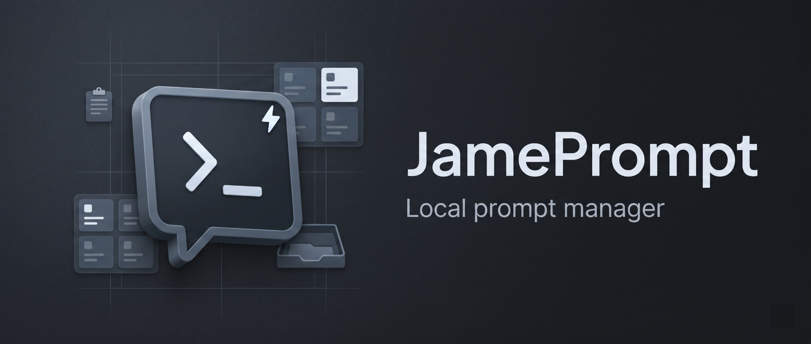
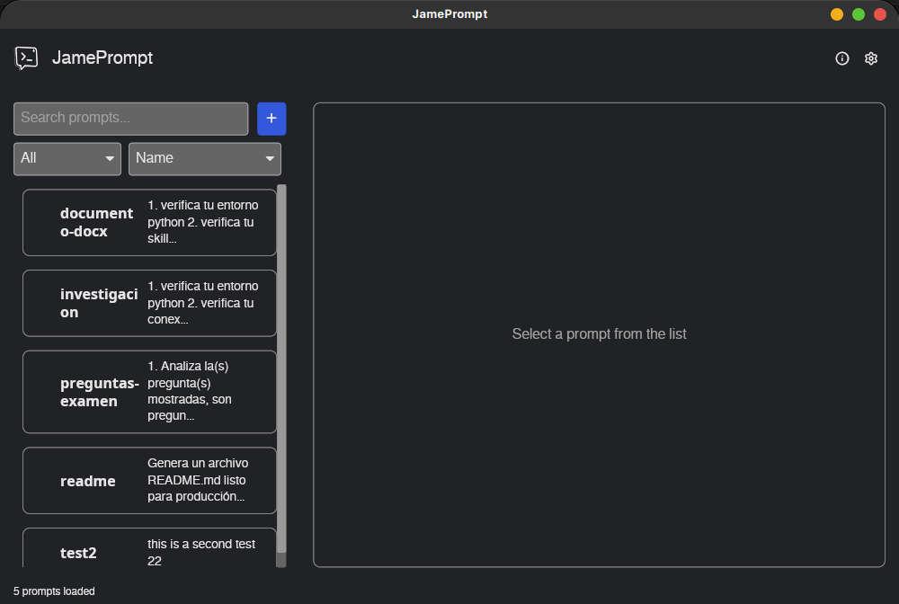
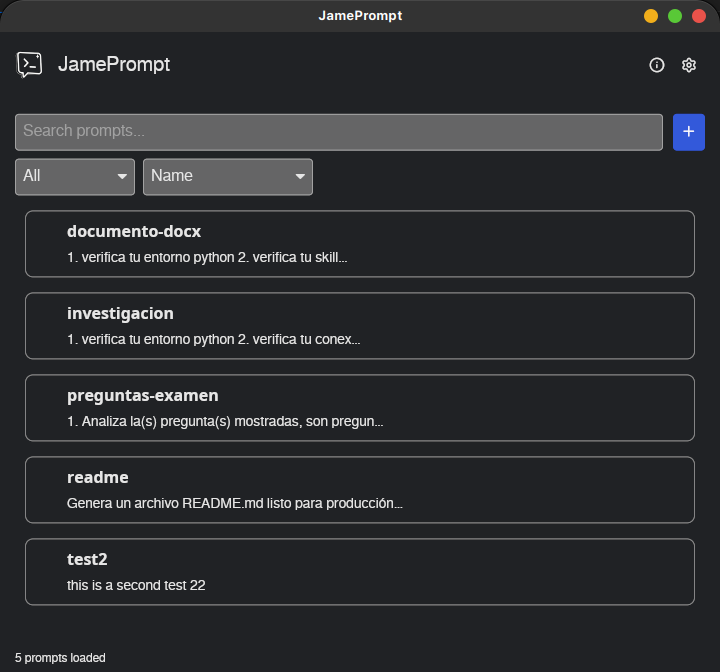
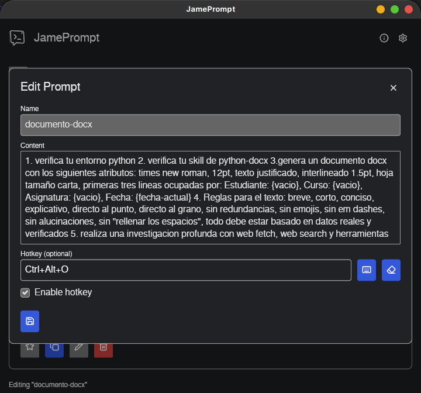
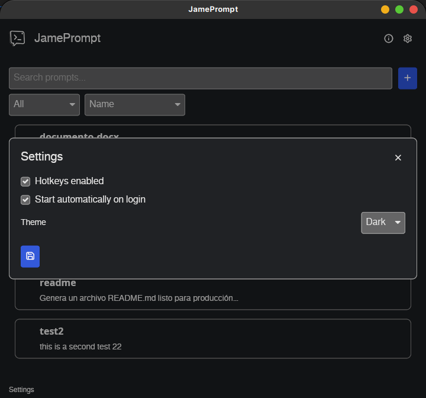
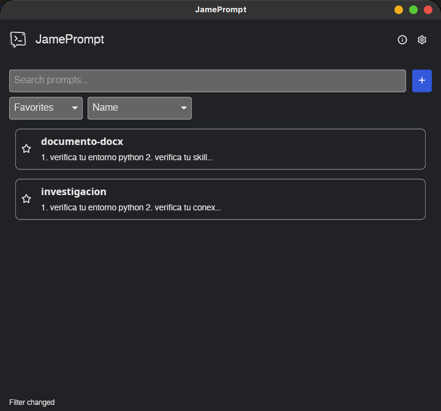
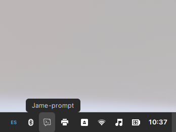
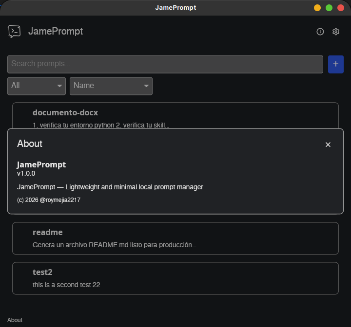

<p align="center">
  
</p>

<h1 align="center">JamePrompt</h1>

<p align="center">
  <a href="https://www.rust-lang.org/">
    
  </a>
  <a href="https://www.sqlite.org/">
    
  </a>
  <a href="LICENSE">
    
  </a>
</p>

<p align="center">
  Lightweight and minimal local prompt manager with SQLite storage, global hotkeys, clipboard integration, autostart, and Linux system tray support.
</p>

---

## Quick Start

```bash
git clone https://github.com/roymejia2217/JamePrompt.git
cd JamePrompt
cargo build --release --locked
```

```bash
./target/release/jame-prompt
```

---

## Features

| Feature | Description |
|---------|-------------|
| **Prompt storage** | Stores prompts locally in SQLite through `rusqlite`. |
| **Search and filtering** | Filters prompts by name or content and supports favorites-based views. |
| **Prompt management** | Creates, edits, deletes, and favorites prompts from the main window. |
| **Clipboard workflow** | Copies prompt content to the clipboard for reuse in other applications. |
| **Global hotkeys** | Registers optional per-prompt shortcuts and triggers prompt actions from anywhere. |
| **System tray** | Hides the window to the tray, restores it, and exposes a Quit action. |
| **Theme settings** | Persists Light and Dark theme selection in `settings.json`. |
| **Autostart** | Syncs desktop autostart from the settings screen. |
| **Data migration** | Migrates existing data from the previous `prompt-manager` data directory when available. |

---

## Prerequisites

| Dependency | Purpose | Installation |
|------------|---------|--------------|
| **Rust toolchain** | Builds and runs the application from source. | `rustup` |
| **pkg-config** | Locates native libraries required by Rust crates. | `sudo apt-get install pkg-config` |
| **GTK 3 development libraries** | Provide the Linux GUI and tray integration layers. | `sudo apt-get install libgtk-3-dev` |
| **X11 development libraries** | Support global hotkeys and paste simulation. | `sudo apt-get install libx11-dev libxtst-dev libxkbcommon-dev` |
| **AppIndicator support** | Enables Linux tray indicator support when the desktop environment provides it. | `sudo apt-get install libayatana-appindicator3-dev` |
| **`libxdo` development library** | Supports simulated paste actions. | `sudo apt-get install libxdo-dev` |
| **Python 3 Pillow** | Generates hicolor launcher icon sizes during Debian packaging. | `sudo apt-get install python3-pil` |

**Notes:**
- Global hotkeys and paste simulation are X11-oriented.
- Tray visibility depends on the desktop environment having an active AppIndicator or status notifier implementation.
- Wayland sessions may restrict global hotkeys and paste simulation.

---

## Linux packaging

JamePrompt supports the following Linux packaging targets:

- Debian
- Arch
- Fedora
- RHEL
- AppImage

Flatpak is not supported.

The native package builds cover the app's Linux integration features, including global hotkeys, paste simulation, system tray support, and autostart.

---

## Installation

```bash
cargo build --release --locked
```

This produces the release binary at `target/release/jame-prompt`.

---

## Usage

### Desktop App

```bash
./target/release/jame-prompt [--start-minimized]
```

1. Launch the app from the terminal or desktop launcher.
2. Create a prompt with a unique name, content, and optional hotkey.
3. Search, filter, sort, favorite, edit, or delete prompts from the main window.
4. Select a prompt to copy its content to the clipboard.
5. Close the window to keep the app running in the system tray.
6. Restore the window from the tray icon or tray menu when needed.
7. Quit from the tray menu when the background process should stop.

**Notes:**
- `--start-minimized` launches the app hidden.
- Prompts are stored in `prompts.db` and settings are stored in `settings.json` inside the application data directory.
- Existing data from the older `prompt-manager` data directory is migrated automatically when present.

---

## Configuration

The `settings.json` file in the application data directory stores persistent preferences, and the app also honors a few environment variables for smoke and performance runs.

| Variable | Required | Description |
|----------|----------|-------------|
| `hotkeys_enabled` | No | Enables per-prompt global hotkeys when set to `true`. Defaults to `false`. |
| `autostart_enabled` | No | Syncs desktop autostart when set to `true`. Defaults to `false`. |
| `theme` | No | Selects the UI theme. Use `Dark` or `Light`. Defaults to `Dark`. |
| `JAME_PROMPT_PERF` | No | Enables performance sampling and report generation. |
| `JAME_PROMPT_PERF_REPORT_PATH` | No | Writes the performance report to the specified path. |
| `JAME_PROMPT_PERF_SLOW_MS` | No | Sets the slow-operation threshold in milliseconds. Defaults to `25`. |
| `JAME_PROMPT_UI_SMOKE_DURATION_MS` | No | Sets the UI smoke soak duration in milliseconds. Defaults to `15000`. |

Example `settings.json`:

```json
{
  "hotkeys_enabled": true,
  "autostart_enabled": false,
  "theme": "Dark"
}
```

---

## Testing

```bash
cargo test --locked
```

Test coverage includes:
- configuration loading, defaults, and migration
- prompt database and service behavior
- hotkey parsing and registration
- autostart synchronization
- UI smoke and packaging metadata checks

---

## Building Executables

```bash
./build.sh
```

The build orchestrator cleans `target/`, builds the release binary, and then runs the available package builds for Debian, Arch, RPM, and AppImage targets.

---

## Project Structure

```text
prompt-manager-rust/
├── assets/
│   ├── icons/
│   │   ├── app_icon.png
│   │   ├── tray_icon.png
│   │   └── hicolor/
│   └── images/
│       ├── app_logo_dark.png
│       └── app_logo_light.png
├── docs/
│   ├── banner.webp
│   └── screenshots/
│       ├── about_window.webp
│       ├── favorites_filter.webp
│       ├── main_window.webp
│       ├── main_window_min.webp
│       ├── prompt_editor.webp
│       ├── settings_window.webp
│       └── system_tray.webp
├── fonts/
│   ├── icons.toml
│   └── lucide.ttf
├── packaging/
│   ├── appimage/
│   │   └── build-appimage.sh
│   ├── arch/
│   │   └── PKGBUILD
│   ├── linux/
│   │   ├── build-deb.sh
│   │   ├── changelog
│   │   ├── copyright
│   │   ├── jame-prompt.1
│   │   ├── jame-prompt.desktop
│   │   └── scripts/
│   └── rpm/
│       └── jame-prompt.spec
├── scripts/
├── src/
│   ├── autostart.rs
│   ├── config.rs
│   ├── db.rs
│   ├── hotkeys.rs
│   ├── icon.rs
│   ├── launch.rs
│   ├── main.rs
│   ├── migrations.rs
│   ├── models.rs
│   ├── perf.rs
│   ├── perf_smoke.rs
│   ├── prompt_repository.rs
│   ├── prompt_service.rs
│   ├── settings_service.rs
│   ├── tray.rs
│   └── ui.rs
├── tests/
│   ├── build_orchestrator.rs
│   ├── packaging_metadata.rs
│   └── ui_smoke.rs
├── build.rs
├── build.sh
├── Cargo.toml
├── Cargo.lock
├── LICENSE
└── README.md
```

---

## Screenshots

| Screenshot | Description |
|---|---|
|  | Main window showing the prompt list, search, and actions. |
|  | Minimized state showing the app kept alive in the system tray. |
|  | Prompt editor for creating and updating prompt content. |
|  | Settings window with theme, hotkeys, and autostart options. |
|  | Favorites filter view for narrowing the prompt list. |
|  | System tray behavior with restore and quit actions. |
|  | About window with app identity and version information. |

---

## License

MIT License. See [LICENSE](LICENSE) for details.
