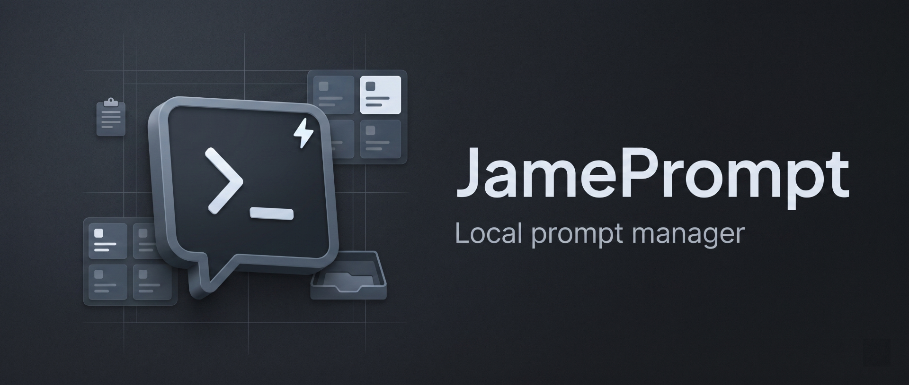
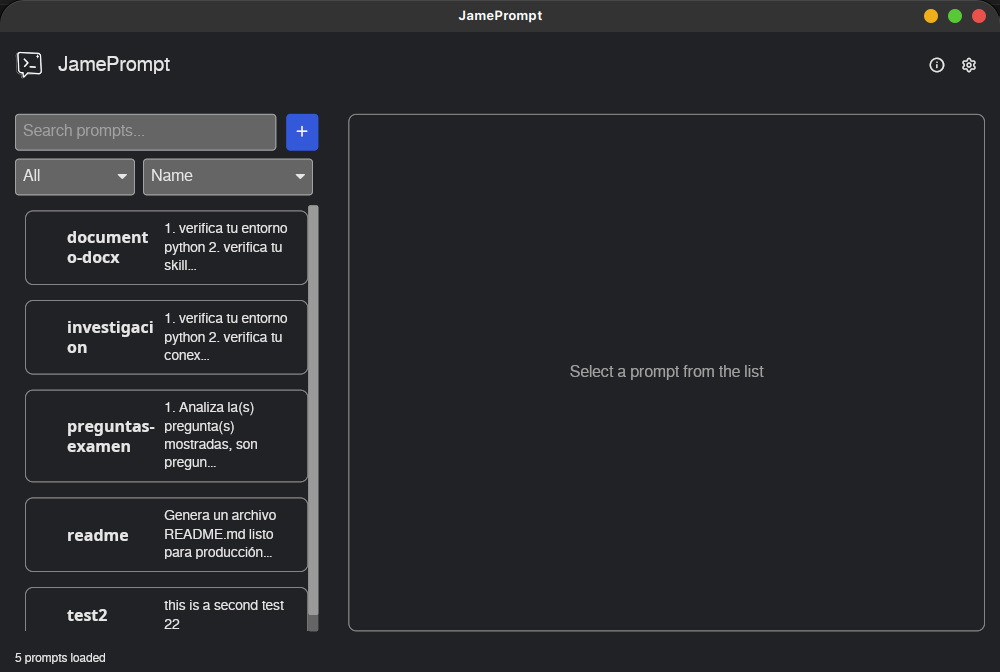
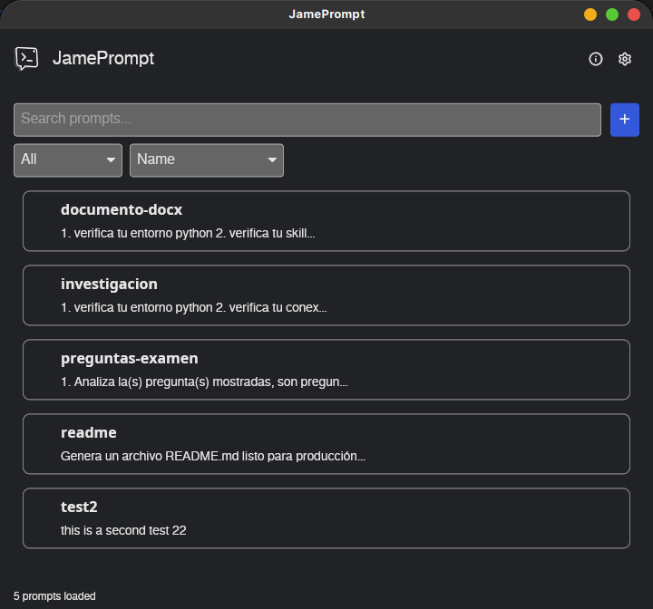
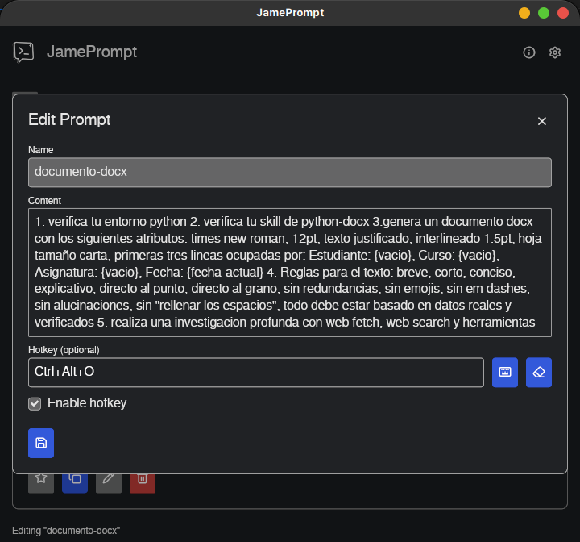
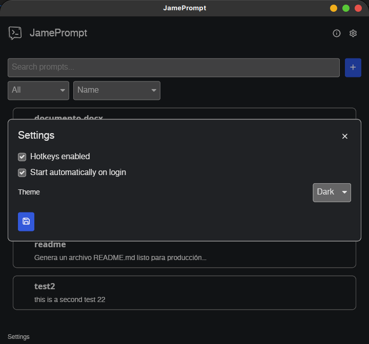
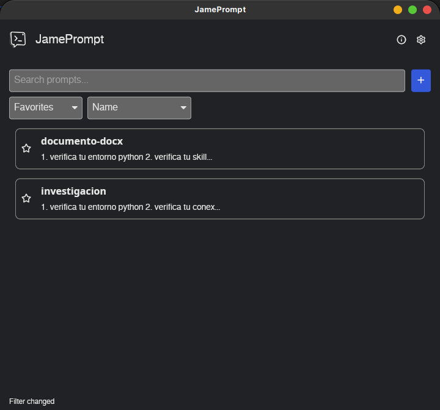
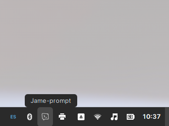
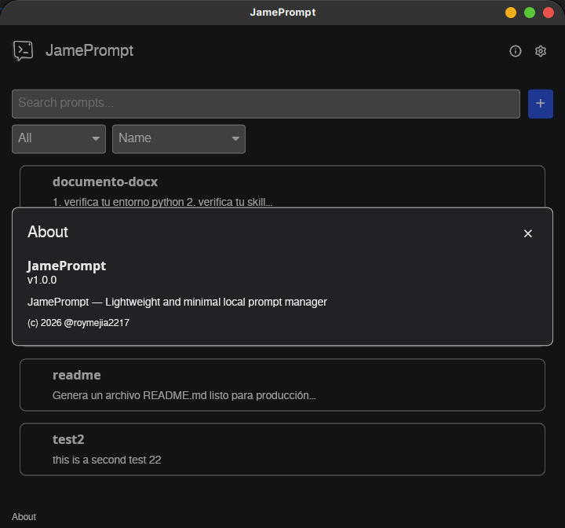

# JamePrompt

<p align="center">
  
</p>

<p align="center">
  <a href="https://www.rust-lang.org/">
    
  </a>
  <a href="https://www.sqlite.org/">
    
  </a>
  <a href="LICENSE">
    
  </a>
</p>

Lightweight local prompt manager with SQLite storage, global hotkeys, clipboard integration, autostart, and system tray support on Linux and Windows.

JamePrompt keeps prompts on the local machine, provides fast search and favorites,
and integrates with desktop workflows through configurable global hotkeys,
clipboard copy and paste simulation, autostart, and system tray behavior.

## Table of Contents

- [Install](#install)
- [Usage](#usage)
- [Features](#features)
- [Platforms and Distribution](#platforms-and-distribution)
- [Configuration](#configuration)
- [Architecture](#architecture)
- [Development](#development)
- [Screenshots](#screenshots)
- [Releases](#releases)
- [Contributing](#contributing)
- [License](#license)

## Install

JamePrompt requires Rust 1.88 or newer when built from source. Iced is pinned to
0.14.0, so builds should use the repository lockfile.

### Linux prerequisites

| Dependency | Purpose | Debian/Ubuntu installation |
| --- | --- | --- |
| Rust toolchain | Builds and runs the application. | Install with [rustup](https://rustup.rs/). |
| `pkg-config` | Locates native libraries required by Rust crates. | `sudo apt-get install pkg-config` |
| GTK 3 development libraries | Provide Linux GUI and tray integration. | `sudo apt-get install libgtk-3-dev` |
| X11 development libraries | Support hotkeys, keyboard mapping, and paste simulation. | `sudo apt-get install libx11-dev libxtst-dev libxkbcommon-dev libxkbcommon-x11-dev` |
| AppIndicator support | Enables tray indicator support where available. | `sudo apt-get install libayatana-appindicator3-dev` |
| `libxdo` development library | Supports simulated paste actions. | `sudo apt-get install libxdo-dev` |
| Python 3 Pillow | Generates hicolor launcher icon sizes for Debian packaging. | `sudo apt-get install python3-pil` |

Clone the repository and build the locked release binary:

```sh
git clone https://github.com/roymejia2217/JamePrompt.git
cd JamePrompt
cargo build --release --locked
```

The Linux binary is produced at `target/release/jame-prompt`.

### Linux desktop notes

- GNOME Wayland tray integration uses destroy/recreate because hidden tray state
  is not supported by that environment.
- Wayland auto-paste requires RemoteDesktop keyboard permission and may display a
  permission dialog during startup or prewarming.
- Global hotkeys on Wayland use the XDG GlobalShortcuts portal.
- Linux X11 requires the xkbcommon X11 runtime package.
- Tray visibility depends on an active AppIndicator or status notifier
  implementation in the desktop environment.

Prebuilt packages are available from
[GitHub Releases](https://github.com/roymejia2217/JamePrompt/releases).

## Usage

Launch the desktop application from a source build:

```sh
./target/release/jame-prompt [--start-minimized]
```

On Windows, run `jame-prompt.exe` from the installed or extracted package.

A typical workflow is:

1. Create a prompt with a unique name, content, and optional hotkey.
2. Search, filter, sort, favorite, edit, or delete prompts from the main window.
3. Select a prompt to copy its content to the clipboard.
4. Close the window to keep the application running in the system tray.
5. Restore the window from the tray icon or tray menu when needed.
6. Use **Export prompts** to create a JSON backup or **Import prompts** to
   review and restore one.
7. Quit from the tray menu when the background process should stop.

`--start-minimized` launches the application hidden. Prompts are stored in
`prompts.db`, while persistent settings are stored in `settings.json` in the
application data directory. Existing data from the older `prompt-manager`
data directory is migrated automatically when present.

## Features

| Feature | Description |
| --- | --- |
| **Prompt storage** | Stores prompts locally in SQLite through `rusqlite`. |
| **Search and filtering** | Filters prompts by name or content and supports favorites-based views. |
| **Prompt management** | Creates, edits, deletes, and favorites prompts from the main window. |
| **Clipboard workflow** | Copies prompt content to the clipboard for reuse in other applications. |
| **Global hotkeys** | Registers optional per-prompt shortcuts and triggers prompt actions from anywhere. |
| **System tray** | Keeps the application available in the tray on Linux and Windows. |
| **Theme settings** | Persists Light and Dark theme selection in `settings.json`. |
| **Autostart** | Synchronizes desktop autostart from Settings on Linux and Windows. |
| **Data migration** | Migrates existing data from the previous `prompt-manager` data directory. |
| **Prompt backup** | Exports schema-versioned JSON and imports backups with merge, replace, and duplicate handling. |

## Platforms and Distribution

### Linux

The release pipeline supports:

- Debian packages
- Arch Linux packages
- Fedora and RHEL RPM packages
- AppImage

Flatpak is not currently supported. Native Linux packages retain global
hotkeys, paste simulation, system tray support, autostart, and the application
desktop identity.

### Windows

Production Windows releases provide:

- MSI installer
- Portable ZIP

The MSI installs JamePrompt under Program Files, registers the application in
Windows Apps & Features, creates a Start Menu shortcut, and removes those
entries during uninstall. The portable ZIP is the supported no-install
distribution.

The raw application executable is not published as a user-facing installer.

## Configuration

The `settings.json` file in the application data directory stores persistent
preferences. Performance and smoke runs also use environment variables.

| Setting or variable | Required | Description |
| --- | --- | --- |
| `hotkeys_enabled` | No | Enables per-prompt global hotkeys. Defaults to `true`. |
| `autostart_enabled` | No | Synchronizes desktop autostart. Defaults to `false`. |
| `theme` | No | Selects `Dark` or `Light`. Defaults to `Dark`. |
| `JAME_PROMPT_PERF` | No | Enables performance sampling and report generation. |
| `JAME_PROMPT_PERF_REPORT_PATH` | No | Writes the performance report to the specified path. |
| `JAME_PROMPT_PERF_SLOW_MS` | No | Sets the slow-operation threshold in milliseconds. Defaults to `25`. |
| `JAME_PROMPT_UI_SMOKE_DURATION_MS` | No | Sets the UI smoke soak duration in milliseconds. Defaults to `15000`. |

Example:

```json
{
  "hotkeys_enabled": true,
  "autostart_enabled": false,
  "theme": "Dark"
}
```

Prompt backups contain prompt records only. Settings remain in
`settings.json` and are not included in backup JSON.

## Architecture

JamePrompt is a Rust desktop application with application/domain separation and
platform-specific adapters around desktop integration.

- `src/application/` contains application-level orchestration and stores.
- `src/domain/` contains domain notification types and policies.
- `src/hotkeys/` and `src/hotkeys.rs` isolate hotkey behavior.
- `src/platform.rs`, `src/tray.rs`, `src/autostart.rs`, and
  `src/window_lifecycle.rs` contain platform-facing integration.
- `src/prompt_repository.rs` and `src/prompt_service.rs` own prompt
  persistence and application operations.
- `packaging/` contains the Linux packaging targets, and `wix/` contains
  Windows installer assets.

## Development

Install the pinned repository tooling and run the complete local change gate:

```sh
npm ci
npm run verify:change
```

The gate includes commit-policy self-tests, release-governance validators,
formatting, and the locked Rust test suite. Focused Rust verification is also
available directly:

```sh
cargo fmt --all -- --check
cargo test --locked --all-targets
```

The packaging orchestrator can build the available Linux distribution formats:

```sh
./build.sh
```

Repository metadata follows Conventional Commits, the checked-in pull-request
schema, Semantic Versioning, and Keep a Changelog. See
[CONTRIBUTING.md](CONTRIBUTING.md) for the authoritative development and
delivery workflow.

## Screenshots

| Screenshot | Description |
| --- | --- |
|  | Main window showing the prompt list, search, and actions. |
|  | Minimized state showing the application kept alive in the system tray. |
|  | Prompt editor for creating and updating prompt content. |
|  | Settings window with theme, hotkeys, and autostart options. |
|  | Favorites filter view for narrowing the prompt list. |
|  | System tray behavior with restore and quit actions. |
|  | About window with application identity and version information. |

## Releases

Published builds and release notes are available from
[GitHub Releases](https://github.com/roymejia2217/JamePrompt/releases).

JamePrompt supports alpha, beta, and stable SemVer release profiles. Tracked
package versions and matching `CHANGELOG.md` metadata must reach protected
`main` before a release tag is created.

## Contributing

Read [CONTRIBUTING.md](CONTRIBUTING.md) before making changes. Pull requests
must satisfy the repository's Conventional Commit, PR metadata, CI, packaging,
and release-governance contracts.

Use [GitHub Issues](https://github.com/roymejia2217/JamePrompt/issues) for
defect reports and project questions.

## License

MIT License. See [LICENSE](LICENSE) for details.
